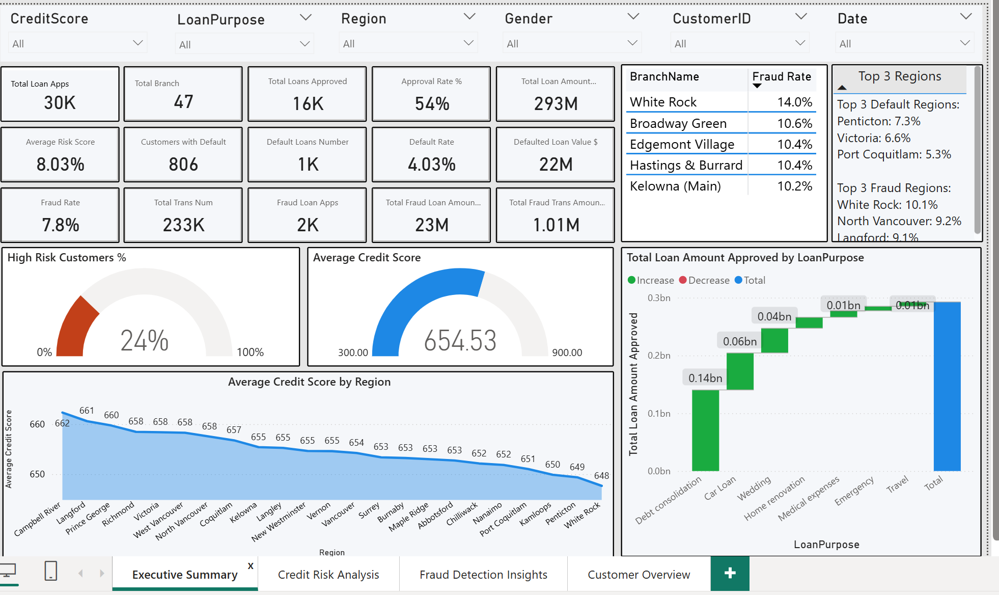
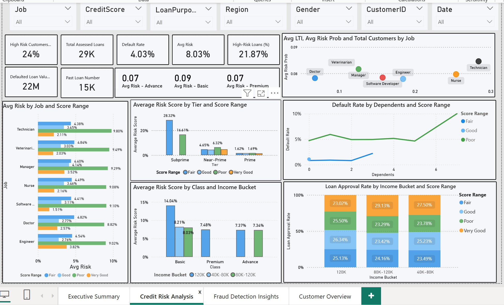
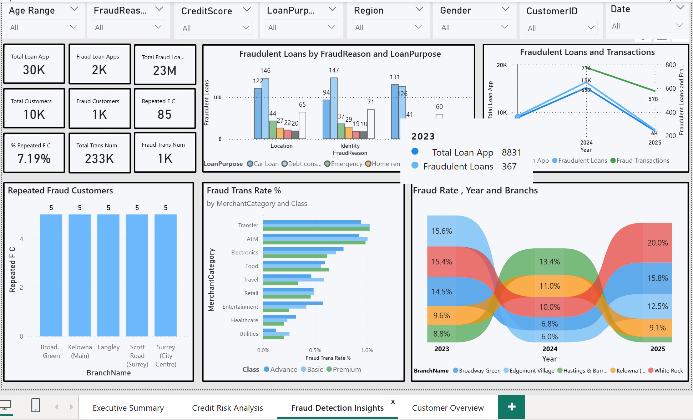
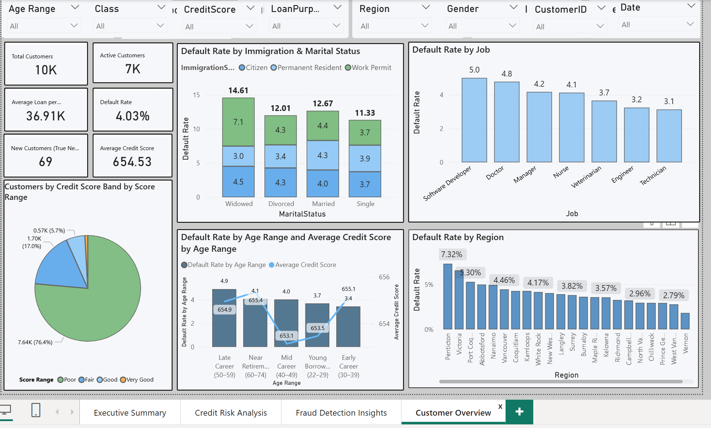

# PowerBI_LoanRiskAnalysis
Power BI dashboards analyzing loan performance, credit risk, fraud, and customer behavior.
# Preliminary Report: Loan & Credit Risk Analysis

## Project Overview

This project provides a comprehensive Power BI solution for financial institutions to monitor and manage loan portfolios, credit risk, fraud, and customer behavior. It empowers decision-makers with clear, actionable insights while aligning with operational, financial, and compliance objectives.

Multiple stakeholder meetings were held with branch managers, risk teams, fraud analysts, finance personnel, IT, and community managers to define scope, objectives, and KPIs. These discussions guided the design of a robust reporting framework.

## Project Objectives

The dashboards are designed to:

- Monitor loan performance and portfolio health
- Assess and manage credit risk
- Detect and analyze fraudulent activities
- Understand customer behavior across branches, regions, and segments

By providing these insights, the project helps maximize profitability, reduce financial risk, and improve operational efficiency.

## Stakeholder Mapping

| Stakeholder Group | Primary Focus |
|------------------|---------------|
| Risk Management Team | Portfolio exposure and risk trends |
| Fraud Team | Fraud detection and resolution performance |
| Community Manager | Customer engagement and regional lending behavior |
| Branch Managers | Branch performance and loan quality |
| Finance Team | Loan provisioning and profitability |
| Audit Team | Internal control and compliance verification |
| IT Team | Data integration, security, and system maintenance |

## Data Requirements & Sources

- **Loan-level data:** origination date, amount, interest rate, term, approval status, LTV, fraud flags, resolution outcomes  
- **Customer behavior data:** credit score history, DTI ratio, past defaults  
- **Transaction & operational metrics:** loan volume, branch performance, regional comparisons  

All data is anonymized to comply with confidentiality requirements.

## Dashboards

### 1️⃣ Executive Summary

High-level overview for leadership:

| KPI | Description |
|-----|-------------|
| Total Loan Applications | Total number of loan applications |
| Total Branches | Number of active branches |
| Total Approved Loans | Number of approved loans |
| Average Loan per Customer | Mean loan size per customer |
| Geographic Diversification | Loan volume and count by region |
| Total Loan Amount | Aggregate portfolio value |
| Average Risk Score | Mean borrower risk score |
| Fraud Rate | Percentage of loans flagged as fraudulent |
| Total Fraudulent Loan Volume | Total value of fraudulent loans |
| Approved Loan Count | Number of loans approved |
| Customers with Defaults | Count of customers who have defaulted |
| Top 5 Branches by Fraud | Branches with highest fraud incidence |
| Top 5 Branches by Default Volume | Branches with highest defaulted loan volume |
| Defaulted Loan Value | Total value of defaulted loans |
| Default Rate | Ratio of defaulted loans to total loans |
| Average Credit Score | Mean borrower credit score |

### 2️⃣ Credit Risk Analysis

Portfolio quality and customer segmentation:

| KPI | Description |
|-----|-------------|
| Default Rate | Ratio of defaulted loans |
| High-Risk Customers | Share of customers with risk label > 0.1 |
| Total Assessed Loans | Ratio of assessed loans to total applications |
| Average Risk | Mean customer risk score |
| High-Risk Loans | Percentage labeled “Subprime” |
| Credit Utilization | Percentage of available credit used |
| Defaulted Loan Volume | Aggregate value of defaulted loans |
| Past Loan Numbers | Total count of historical loans |

### 3️⃣ Fraud Analysis

Fraud patterns, system performance, exposure:

| KPI | Description |
|-----|-------------|
| Total Fraud Volume | Aggregate value of fraudulent loans |
| Total Loan Applications | Total submitted applications |
| Total Fraudulent Loan Volume | Sum of flagged loan amounts |
| Total Customers | Number of customers applied |
| Fraud Customers | Customers with fraudulent applications |
| Repeated Fraud Customers | Customers with multiple fraudulent applications |
| % Repeated Fraud Customers | Share of repeat fraud cases |
| Fraudulent Transactions | Count of flagged transactions |

### 4️⃣ Customer Overview

Customer-level view for relationship managers:

| KPI | Description |
|-----|-------------|
| Total Customers | Total loan applicants |
| Active Customers | Customers currently holding a loan |
| Default Rate | Ratio of defaulted loans |
| Average Loan per Customer | Mean loan value per customer |
| New Customers | Customers initiated loans in last 30 days |
| Average Credit Score | Mean credit score of all customers |

## Tools & Skills

- **Power BI:** dashboards, DAX measures, visuals  
- **Excel & SQL:** data cleaning, aggregation, transformation  
- **Data Analysis:** credit risk modeling, portfolio monitoring, fraud detection  
- **Stakeholder Engagement:** requirement gathering, KPI definition  

## Key Insights

- Analyzed 30K loan applications across 47 branches, with 16K approvals and a total portfolio of $293M  
- Identified high-risk branches and customer segments for monitoring  
- Highlighted fraud patterns to optimize detection strategies  
- Delivered dashboards enabling real-time monitoring and decision-making

## Screenshots

  
  
  

